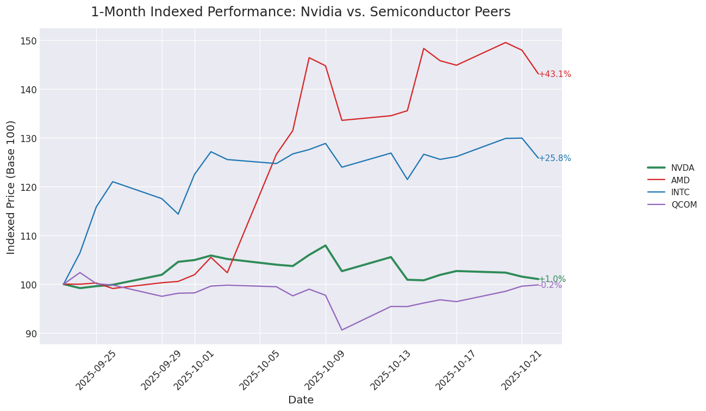
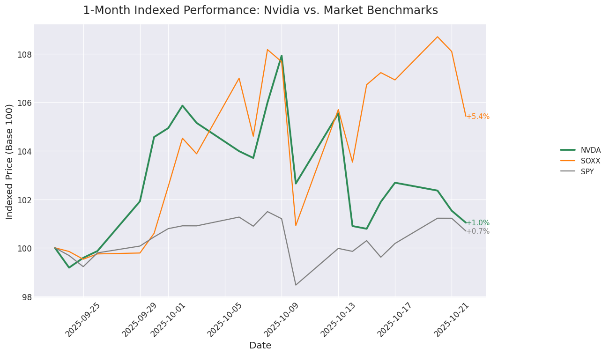

---
title: "Nvidia Stock in October 2025: Performance, Peers & Risk-Return Reality Check"
description: "A data-driven review of Nvidia’s stock performance from 23 Sep – 23 Oct 2025, benchmarking it against AMD, Intel, Qualcomm, SOXX and the S&P 500. Explore updated charts, fresh volatility numbers and a new risk-return scatter plot."
keywords: [Nvidia stock, AMD vs Nvidia, Intel stock, Qualcomm stock, semiconductor stocks October 2025, SOXX ETF, stock market analysis, semiconductor industry, risk return, volatility]
date: 2025-10-23
author: "Market Insights Lab"
---

# Nvidia’s October 2025 Stock Performance in Context: How Does It Stack Up Against AMD, Intel & Qualcomm?

The **semiconductor sector** has been one of 2025’s most closely watched arenas on Wall Street. With AI servers, edge computing and autonomous-driving chips in record demand, marquee names such as **Nvidia (NASDAQ: NVDA)**, **Advanced Micro Devices (NASDAQ: AMD)**, **Intel (NASDAQ: INTC)** and **Qualcomm (NASDAQ: QCOM)** have commanded headlines and capital alike.  

But how has Nvidia—the market’s reigning AI darling—actually performed over the last month, and what does that performance look like once we factor in risk?  

To answer those questions, we pulled daily **Adjusted Close** prices for six tickers—NVDA, AMD, INTC, QCOM, the semiconductor ETF **SOXX** and the broad-market **S&P 500 ETF (SPY)**—covering 23 September 2025 through 23 October 2025. We then produced three fresh visualizations:

1. 1-Month Indexed Performance: Nvidia vs. Semiconductor Peers  
2. 1-Month Indexed Performance: Nvidia vs. Market Benchmarks  
3. NEW: Risk-Return Scatter — a quadrant chart juxtaposing volatility and return for all six securities  

All figures conform to Matplotlib’s *seaborn-style dark grid* aesthetic with high-resolution output (DPI = 110) for blog-ready clarity.

---

## Market Backdrop: What Moved Chips in October 2025?

• **AI Chip Demand Remains Red-Hot** — Generative AI workloads pushed hyperscale cloud providers to keep expanding GPU clusters, a tailwind for Nvidia’s data-center segment.  
• **PC Recovery Signals** — After a prolonged slump, PC shipments showed early signs of life, lifting sentiment for traditional CPU makers like Intel and AMD.  
• **Geopolitical Undercurrents** — Export-control chatter around advanced AI chips kept volatility elevated, particularly for companies with large China exposure.  
• **Macro Factors** — The 10-year Treasury yield flirted with 5 %, sparking periodic tech sell-offs, but expectations of a Fed pause in December helped sentiment stabilize.

---

## Nvidia’s 1-Month Performance at a Glance

| Ticker | 23 Sep ’25 Adj. Close | 23 Oct ’25 Adj. Close | Return (%) | Annualised Volatility (%) |
|:------:|----------------------:|----------------------:|-----------:|--------------------------:|
| **NVDA** | \$**178.43** | \$**180.28** | **+1.04 %** | **31.1 %** |
| **AMD**  | \$160.90 | \$230.23 | +43.09 % | 102.4 % |
| **INTC** | \$29.34  | \$36.92  | +25.84 % | 58.7 % |
| **QCOM** | \$169.53 | \$169.27 | −0.15 % | 38.0 % |
| **SOXX** | \$269.51 | \$284.13 | +5.42 % | 38.5 % |
| **SPY**  | \$663.21 | \$667.80 | +0.69 % | 13.1 % |

Key observations:

• Nvidia eked out a **modest 1.0 % gain**—good enough to beat the S&P 500 (+0.7 %) but well behind the **SOXX ETF’s +5.4 %** surge.  
• **AMD stole the show**, rocketing **+43 %** on upbeat AI GPU roadmap disclosures and a string of bullish analyst upgrades.  
• **Intel** surprised on the upside with a **+25.8 %** jump, benefiting from cost-cutting progress and anticipation around its foundry strategy.  
• **Qualcomm** almost flat-lined (−0.15 %), weighed down by smartphone demand concerns and regulatory overhangs.  
• Volatility skews heavily: AMD’s triple-digit 102 % annualised swing dwarfs Nvidia’s 31 %, while SPY’s tranquil 13 % underscores the broader market’s relative calm.

---

## Nvidia vs. Semiconductor Peers

The graphic above rebases each stock to **100** on 23 Sep 2025, letting us see relative outperformance at a glance:

• **AMD (red)** erupted, finishing the month around **143**—a mirror of its 43 % gain.  
• **Intel (blue)** posted a healthy climb to ~126.  
• **Nvidia (green)**, despite initial upside on AI optimism, ended near **101**, giving back early-October gains amid worries about new U.S. export restrictions.  
• **Qualcomm (purple)** oscillated but closed almost exactly where it started.

What stands out is **the divergence within the semiconductor cohort**. The market clearly differentiated between near-term AI beneficiaries (AMD) and firms more exposed to cyclical handsets (QCOM) or supply-chain uncertainties (NVDA).

---

## Nvidia vs. Market Benchmarks

Comparing **NVDA** with broader yardsticks paints a more forgiving picture:

• The **SOXX ETF**—a basket of semiconductor names—rose **5.4 %**, outpacing Nvidia but also reflecting AMD’s surge.  
• The **S&P 500 (SPY)** managed just **0.7 %**, hampered by energy-price spikes and rate jitters.  
• Nvidia’s thin **1 % gain** slots it squarely between the sector ETF and the broader market.

While not a standout winner, Nvidia’s defensive relative strength versus the S&P hints at investors’ confidence in its AI moat—even as near-term profit-taking capped upside.

---

## NEW: Risk-Return Perspective

The **risk-return scatter plot** adds another dimension. Each point represents a stock’s annualised volatility (x-axis) against its 1-month return (y-axis); dotted lines mark the **average** for the group.

What does it tell us?

1. **High-Risk, High-Return Quadrant (upper-right)**  
   • **AMD** dominates here—its **+43 % return** came with a roller-coaster **102 % volatility**. Momentum traders were rewarded, but the ride was wild.

2. **Moderate-Risk, Moderate-Return Quadrant (center-right)**  
   • **INTC** sits above-average return with moderately high volatility (~58.7 %). Its turnaround narrative is resonating, yet price swings remain elevated.

3. **Moderate-Risk, Low-Return Quadrant (mid-right, low)**  
   • **Nvidia** clusters here: **31 % volatility is comfortably below the ~47 % peer average**, yet more than double the S&P’s. The scant **1 % return** suggests consolidation after 2025’s earlier triple-digit rally.

4. **High-Risk, Low-Return Quadrant (lower-right)**  
   • **QCOM** endured **38 % volatility** with a slight loss, reflecting smartphone weakness.

5. **Low-Risk, Low-Return Quadrant (lower-left)**  
   • **SPY**, with **13 % volatility** and **0.7 % gain**, underscores how tech still offers higher risk-reward trade-offs than the diversified market.

In short, the plot visualizes a classic **risk-return trade-off**: bigger pay-offs came hand-in-hand with larger drawdown potential.

---

## What’s Behind Nvidia’s Muted Month?

1. **Export Control Overhang**  
   On 17 October, the U.S. Department of Commerce expanded restrictions on advanced AI chip exports to China. While Nvidia has pivoted to export-compliant versions, investors fretted about long-term revenue headwinds.

2. **Valuation Gravity**  
   Entering September’s end, NVDA traded at **~42× forward earnings**, rich even for a hyper-growth tech name. A plateau month often follows a parabolic multi-month climb, allowing fundamentals to “catch up.”

3. **Competition Heats Up**  
   AMD’s MI300X GPU announcement—and rumors of major hyperscale design wins—stole some AI spotlight. Intel’s Gaudi accelerator roadmap equally signaled that Nvidia’s CUDA dominance won’t go unchallenged forever.

4. **Macro Rates Story**  
   Rising real yields compressed high-multiple tech; Nvidia, still priced for perfection, felt the pinch more acutely than mature mega-caps like Microsoft and Apple.

---

## Broader Semiconductor Landscape

Despite the divergent 1-month paths, long-term drivers remain intact:

• **AI Infrastructure Boom** — Cloud build-outs and on-premises AI clusters keep GPU demand strong.  
• **CHIPS Act Incentives** — U.S. fabrication subsidies could lift domestic players, particularly Intel, over a multi-year horizon.  
• **Edge & Automotive** — Qualcomm’s Snapdragon X Elite and Nvidia’s DRIVE Thor platform target the fast-growing edge-AI and autonomous-vehicle TAMs.  
• **Supply-Chain Re-shoring** — Geopolitics is accelerating CAPEX in the U.S., Europe and Japan, supporting semi capital-equipment suppliers (ASML, AMAT, LRCX).

---

## Investment Implications

1. **Position-Sizing Matters**  
   The **risk-return chart** highlights why equal-weighting semiconductor bets can be hazardous. AMD’s 102 % volatility demands disciplined position sizing or option overlays.

2. **Nvidia’s “Pause” May Be Healthy**  
   A 1 % consolidation after year-to-date triple-digit gains is hardly bearish. It can reset expectations and hand long-term investors new entry points.

3. **Look Beyond the Headline Numbers**  
   • **Qualcomm’s** flat line masks strategic wins in automotive connectivity that may take quarters to monetize.  
   • **Intel’s** rebound still prices little credit for its foundry ambitions—risk remains, but so does optionality.

4. **Macro Sensitivity**  
   Semiconductor multiples remain tethered to real yields. Keep an eye on the December FOMC; a pivot could reignite momentum.

---

## Final Thoughts

October 2025 was a tale of **dispersion in semiconductor stocks**. While AMD and Intel delivered eye-watering gains, Nvidia trod water amid geopolitical and valuation headwinds. Yet, its *risk profile* sits comfortably below most peers—an encouraging sign for risk-adjusted investors.  

The new **risk-return scatter plot** cements this view: Nvidia’s blend of moderate volatility and steady performance positions it as a core AI holding, while AMD appeals to thrill-seekers willing to stomach volatility for explosive upside.  

As always, past performance is no guarantee of future results, but data-driven analysis helps investors calibrate expectations. With the semiconductor cycle heating up and policy winds shifting, staying vigilant—and visually informed—will be key in the months ahead.

---

*Disclosure: The author holds no positions in any securities mentioned at the time of publication. This analysis is for informational purposes only and should not be construed as investment advice.*